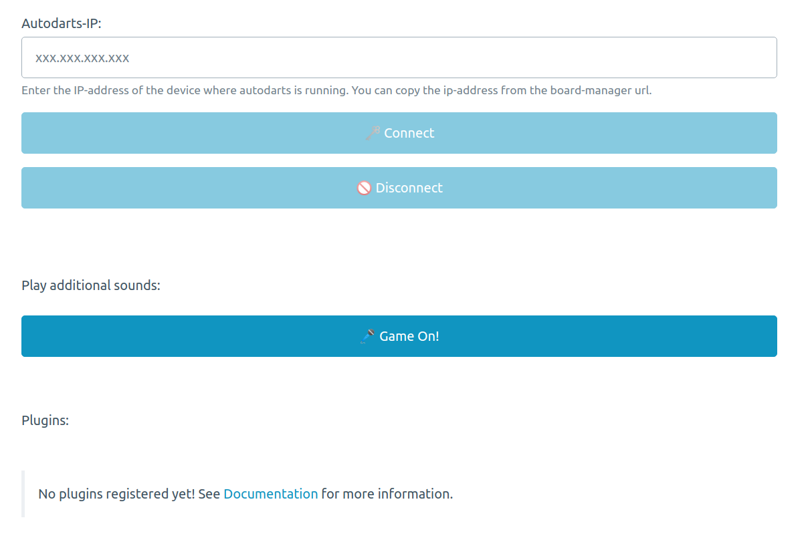

# autodarts-caller

Caller-functionality for your [autodarts.io](https://github.com/autodarts/docs)-setup. You can also extend the functionality with [custom plugins](#extending-with-plugins).

## Installation

> [!IMPORTANT]  
> Perhaps consider using [lbormann/autodarts-caller](https://github.com/lbormann/autodarts-caller), which offers you more functions and is better and more regularly maintained.

The following guide is designed for the raspberry-pi but this is no hard requirement.

### Install docker and autodarts-caller
1. Log-in to your raspberry-pi via ssh
1. Go to your home-directory: 
    - `cd ~`
1. Install `docker` (we use docker to easily start a webserver on which we run the caller-app):
    - `curl -fsSL https://get.docker.com | sh`
1. Check if installation was successful by running a hello-world image: 
    - `sudo docker run --rm arm32v7/hello-world`
    - If you see no errors everything should be fine
1. Download and unzip `autodarts-caller`:
    1. `wget https://github.com/mbernwieser/autodarts-caller/releases/download/1.1.0/autodarts-caller.zip`
    1. `unzip -o autodarts-caller.zip -d .`
1. Go to the `autodarts-caller`-directory you just created:
    - `cd autodarts-caller/`
1. Make installation-script executable: 
    - `chmod +x install_autodarts_caller.sh`
1. Run `autodarts-caller` install-script:
    - `./install_autodarts_caller.sh`

### Add caller sounds 
1. Sound files have to be added to `autodarts-caller/sounds/`
1. Either you create sounds by yourself or you use existing soundpacks
    - Due to copyright issues the sounds are not included in this repository but you can find them in various dart-communities
    - Example (Russ Bray): https://www.dartn-forum.de/thread/129-russ-bray-sounds-f%C3%BCr-dartpro-software/?postID=473437#post473437
    - Darts Gondel (German sounds for 2€): https://www.dartzentrum-augsburg.de/produkt/darts-gondel-01-caller-sound-dateien 
1. Requirement: all sound files must be in .mp3 format
    - if the sounds are in a different format they have to be converted to .mp3 first
1. Possible sounds:
    - 1.mp3 - 180.mp3
    - 0.mp3 ("no score")
    - gameon.mp3 ("gameon" on succesful connect & additional sound buttons)

#### Transfer sounds to the raspberry-pi

An easy way to add the sounds is to use a programm like `FileZilla`:
1. Download and install `FileZilla` on the system from where you connect to the raspberry-pi
1. Open `FileZilla` and connect to your raspberry-pi with the following parameters:
    1. `Server`: `<ip-address-of-your-raspberry-pi>`
    1. `Username`: `<your-raspberry-pi-username>` (default = "pi")
    1. `Password`: `<your-raspberry-pi-password>` 
    1. `Port`: `22`
1. Now you should be able to just drag and drop the sounds from your system to the raspberry-pi
    - File structure should look like:
    - `autodarts-caller/sounds/0.mp3`
    - `autodarts-caller/sounds/1.mp3`
    - `autodarts-caller/sounds/2.mp3`
    - `...`

### Add video files
1. Video files can be added to `autodarts-caller/videos/`
1. All video files must be in .mp4 format
1. The default video-caller plugin will look for the following video-files:
  - 0.mp4 - 180.mp4

## Running 
1. **You can start/stop the autodarts-caller with:**
    - `sudo docker start autodarts-caller`
    - `sudo docker stop autodarts-caller`
1. Start `autodarts` (if not already running):
    - `autodarts`

## Usage
1. Open a browser on a device from where you want to play the sounds on
1. Go to: `<ip-of-your-raspberry-pi>:8080`
    - you can copy the ip-address from the board-manager url
    - e.g. `192.168.178.73:8080`
1. Now you should see the `autodarts-caller` web-ui (see screenshot below)
1. In the `Autodarts-IP:`-field you should enter the IP where autodarts is running (propably the same `<ip-of-your-raspberry-pi>`)
    - Enter the IP without `http` or `/`
    - you can copy the ip-address from the board-manager url
    - e.g. `192.168.178.73`
1. Click on `Connect`
1. Throw three darts and if everything works you should hear your score

|                                          |
| :--------------------------------------------------------------: |
| _Screenshot from `autodarts-caller` Web-UI_ |

## Drawbacks

**Important:** This tool has no access to the information of your current match. It can only call the score of your thrown three darts. Neither does it now if you've just won a leg, nor does it call the remaining points. If you want a more sophisticated caller, you should use xy [lbormann/autodarts-caller](https://github.com/lbormann/autodarts-caller)

**Besides that: the autodarts-api is not stable yet and can change anytime. This means that this tool may stop working after a new release of autodarts.**

## Updating

**Attention!** This update-process will override any changes you made to `autodarts-caller` files which are provided by default. This especially goes for sound-files (sound-effects) and default-plugins.

**Therefore: always create new files for your customizations! Those will not be overridden during this update process. For example your own caller-files (1.mp3, 2.mp3, etc.) will not be touched.**

To update `autodarts-caller` run those commands:

1. Log-in to your raspberry-pi via ssh
1. Go to your home-directory: 
    - `cd ~`
1. *Optional / Recommended if you've added custom plugins/logic:* Create a backup of the old files
    - `cp -r autodarts-caller/ autodarts-caller-backup-DATE_OF_BACKUP/`
1. Remove old zip-file
    - `rm autodarts-caller.zip`
1. Download new version (in this example: 1.1.0, for all available versions see: [Releases](https://github.com/mbernwieser/autodarts-caller/releases))
    - `wget https://github.com/mbernwieser/autodarts-caller/releases/download/1.1.0/autodarts-caller.zip`
1. Unzip new version
    - **This will replace all files which are provided by default by `autodarts-caller`!**
    - **Files which were created by you will be kept! So move custom plugin-logic to new files**
    - `unzip -o autodarts-caller.zip -d .`
1. If you use custom plugins:
    - Unfortunately for now you have to re-add the import of them manually in the `index.html` file
1. Restart docker container
    - `sudo docker restart autodarts-caller`
1. Open `autodarts-caller` in the browser and reload the page via `Shift + F5` (Chrome) or `CTRL + F5` (Firefox) to force a reload of all files

## Extending with plugins

You can write your own plugins in JavaScript to extend the functionality of this tool. Maybe you want to play your favorite song if you score yet another S1 | S1 | S1 or activate some LEDs if you finally hit the 180.

To do that you just have to:
1. Copy the plugin-template `plugins/template.js` to `plugins/your-custom-plugin.js`
1. Import your plugin in `index.html`
1. Add your custom logic in `plugins/your-custom-plugin.js`
1. ... if you've created a cool plugin, don't forget to share it with the Autodarts-Community

You can also orientate on the pre-installed [Sound Effects-plugin](public/plugins/sound-effects.js) which plays sounds in 8-bit style after each throw.

### Adding logic to your plugins

All information about the throw can be found in the throw-event, just take a look at the information via `console.log(event)`. From here you can do whatever you want:
- call other APIs (e.g. some LED system) with a simple fetch-call: [JS-Docs](https://developer.mozilla.org/en-US/docs/Web/API/Fetch_API/Using_Fetch)
- you can call the built-in sound-service
    - `event.soundService.playAudio(filename, duration = null);`
- you can call the built-in notification-service
    - `event.notificationService.success(message, options = {});`
    - [all functions and options](https://ember-cli-notifications.netlify.app/)

## Contributing

This simple web-app is built with Ember.js. The main-logic (= handling of websocket messages) is done in `app/services/websocket.js`. For development details see: [CONTRIBUTING.md](CONTRIBUTING.md).

## Customizing (quick quide)

- See [CONTRIBUTING.md](CONTRIBUTING.md) for development requirements
- Clone project
- Update files in `app/`
- Build project: `ember build --environment=production`
- Zip built files: `zip -r autodarts-caller.zip autodarts-caller`
- Created zip-file `autodarts-caller.zip` can be transfered to raspberry-pi 
- Then follow installation guide starting from: "Download and unzip..." (Replace zip-file with your built folder)
